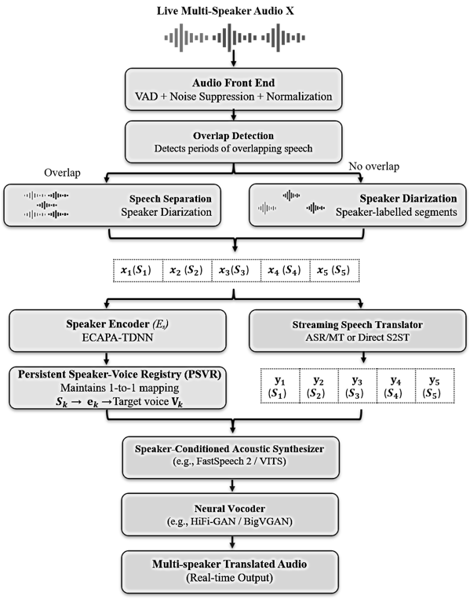

# SAMSLT

## Speaker-Aware Multi-Speaker Live Translation

SAMSLT is a modular research codebase for speaker-aware multi-speaker speech-to-speech translation (S2ST), including overlapping speech, persistent speaker attribution, and stable target-voice assignment.



## Repository organization

SAMSLT follows a multi-package structure so that each major block in the system architecture can be developed, tested, and replaced independently.

| Package | Purpose |
|---|---|
| `commons` | shared data models, audio utilities, logging and configuration |
| `samslt-audio` | VAD, noise suppression, normalization and front-end audio preparation |
| `samslt-overlap` | overlap detection, overlap-region management and speech separation adapters |
| `samslt-diarization` | speaker diarization and speaker-labelled segments |
| `samslt-speaker` | ECAPA-TDNN embeddings, speaker matching, re-identification and PSVR |
| `samslt-translation` | ASR, MT, direct S2ST adapters and chunk-level translation |
| `samslt-voice` | target-voice management, acoustic synthesis, vocoding and waveform mixing |
| `samslt-evaluation` | translation, diarization, speaker, overlap, naturalness and latency evaluation |
| `samslt` | unified high-level SAMSLT pipeline and public API |
| `resources` | configuration files, database schema, SQL, prompts and diagrams |
| `sample_data` | non-sensitive sample metadata and instructions for local audio |
| `docs` | architecture, methods mapping, reproducibility and evaluation documentation |

## Architecture

The system follows two synchronized pathways:

**Speaker-identity pathway**

```text
Audio front end
  -> overlap detection
  -> speech separation when required
  -> speaker diarization
  -> ECAPA-TDNN speaker representation
  -> speaker re-identification
  -> Persistent Speaker-Voice Registry (PSVR)
```

**Translation pathway**

```text
speaker-labelled speech
  -> ASR + MT or direct S2ST
  -> translated linguistic content
```

The two pathways converge at speaker-conditioned synthesis. The assigned target voice is retrieved from the PSVR and used for synthesis. A neural vocoder generates the output waveform.

## PSVR

SAMSLT uses a lightweight SQLite store for conversation-level persistence. The PSVR records:

- session identifier;
- source speaker identifier;
- serialized speaker embedding;
- first-seen and last-seen timestamps;
- assigned target voice;
- assignment timestamp.

The database is an implementation choice for persistence, not a requirement of the conceptual architecture.

## Installation

```bash
python -m venv .venv
```

Windows:

```powershell
.venv\Scripts\Activate.ps1
```

Linux/macOS:

```bash
source .venv/bin/activate
```

Then:

```bash
python -m pip install --upgrade pip
pip install -r requirements.txt
pip install -e ./commons
pip install -e ./samslt-audio
pip install -e ./samslt-overlap
pip install -e ./samslt-diarization
pip install -e ./samslt-speaker
pip install -e ./samslt-translation
pip install -e ./samslt-voice
pip install -e ./samslt-evaluation
pip install -e ./samslt
```

## External models

The repository intentionally does **not** redistribute pretrained model weights.

Typical experimental backends may include:

- pyannote.audio for diarization;
- ECAPA-TDNN for speaker embeddings;
- a two-speaker separation model for overlap regions;
- Whisper-compatible ASR;
- multilingual MT or direct S2ST;
- speaker-conditioned/multi-voice TTS;
- a neural vocoder.

Each external model remains subject to its own licence and model-card terms.

## Quick API example

```python
from samslt import SAMSLTPipeline

pipeline = SAMSLTPipeline(
    source_language="es",
    target_language="en",
)

print(pipeline.describe())
```

## Research status

This repository is an implementation framework for the SAMSLT architecture. Claims about real-time performance, translation quality, DER, speaker similarity, speaker confusion, overlap robustness, naturalness, or latency require experimental measurement on stated datasets and hardware.

## Documentation

- `docs/ARCHITECTURE.md`
- `docs/METHODS_MAPPING.md`
- `docs/EVALUATION.md`
- `docs/REPRODUCIBILITY.md`
- `docs/DATA.md`
- `docs/PSVR.md`
- `docs/STREAMING.md`
- `docs/LIMITATIONS.md`

## Citation

See `CITATION.cff`.

## Licence

Repository code is released under the MIT License. Third-party libraries, model weights, voice models and datasets retain their own terms.
